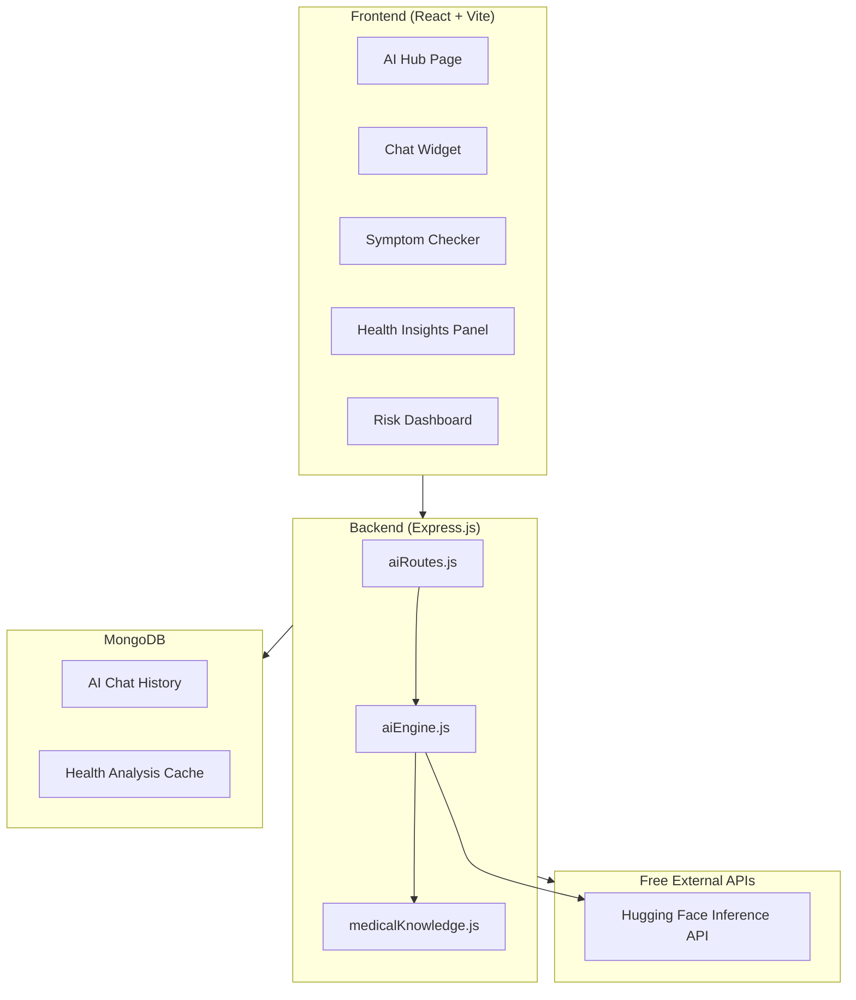

# AI Integration — Virtual Consultation Platform

## Overview

Integrate **10 AI-powered healthcare features** into the existing Virtual Consultation platform using **free, open-source** AI services. The primary AI engine will be **Hugging Face Inference API** (free tier — no credit card needed) combined with **built-in algorithmic intelligence** for health analysis, risk scoring, and trend prediction.

> [!IMPORTANT]
> All AI features use **free APIs only**. No paid services. Hugging Face free tier provides 1,000 requests/day which is more than sufficient for a development/demo project.

---

## Architecture



---

## AI Features Summary

| # | Feature | AI Method | Free API/Tool |
|---|---------|-----------|--------------|
| 1 | **AI Health Chat Assistant** | Medical text generation | Hugging Face (BioGPT / Medical LLM) |
| 2 | **Symptom Checker + Medical NER** | Named Entity Recognition | Hugging Face (OpenMed NER models) |
| 3 | **Health Risk Predictor** | Algorithmic + ML scoring | Built-in (no external API) |
| 4 | **Smart Supplement Interactions** | NLP drug interaction analysis | Hugging Face + Medical KB |
| 5 | **AI Nutrition Analyzer** | Text-to-nutrition extraction | Hugging Face NER + USDA API |
| 6 | **Mental Health Mood Analyzer** | Sentiment analysis + patterns | Hugging Face (sentiment models) |
| 7 | **AI Health Insights Engine** | Data correlation + trends | Built-in analytics engine |
| 8 | **Smart Appointment Pre-screening** | Symptom → specialty matching | Hugging Face NER + rules |
| 9 | **AI Body Insights** | Organ risk from health data | Built-in + medical KB |
| 10 | **AI Group Recommendations** | Profile → group matching NLP | Built-in similarity scoring |

---

## Proposed Changes

### Backend — New Files

---

#### [NEW] [aiRoutes.js](file:///c:/VirtualConsultation_Back/aiRoutes.js)

All AI API endpoints, mounted as `/api/ai/*`:

- `POST /api/ai/chat` — AI Health Chat (conversational health assistant)
- `POST /api/ai/symptom-check` — Symptom analysis with NER entity extraction
- `GET /api/ai/health-risk` — Personalized health risk assessment
- `POST /api/ai/supplement-interactions` — AI drug/supplement interaction checker
- `POST /api/ai/analyze-nutrition` — Natural language food → nutrition data
- `POST /api/ai/mood-analysis` — Sentiment analysis on mood journal text
- `GET /api/ai/health-insights` — Weekly AI-generated health report
- `POST /api/ai/appointment-prescreen` — Symptom → doctor specialty recommendation
- `GET /api/ai/body-insights/:organ` — Organ-specific health risk analysis
- `GET /api/ai/group-recommendations` — AI-powered health group suggestions

---

#### [NEW] [aiEngine.js](file:///c:/VirtualConsultation_Back/aiEngine.js)

Core AI processing module containing:

- **`callHuggingFace(model, inputs)`** — Unified Hugging Face API wrapper with retry logic + rate limiting
- **`extractMedicalEntities(text)`** — NER pipeline for diseases, symptoms, drugs, anatomy
- **`generateHealthResponse(context, question)`** — Medical chat response generation
- **`analyzeSentiment(text)`** — Mood/sentiment scoring
- **`calculateHealthRisk(profile, metrics)`** — Algorithmic risk scoring engine
- **`correlateHealthData(metrics, timeRange)`** — Cross-metric trend analysis
- **`analyzeNutritionText(text)`** — Food description → macro extraction

---

#### [NEW] [medicalKnowledge.js](file:///c:/VirtualConsultation_Back/medicalKnowledge.js)

Comprehensive medical knowledge base (no external API needed):

- **Drug/supplement interaction database** (500+ known interactions)
- **Symptom → condition mapping** (100+ conditions)
- **Symptom → specialty routing** (12 specialties)
- **Organ → risk factor mapping** (for Body Insights)
- **BMI/vitals risk thresholds** (WHO guidelines)
- **Nutrition RDA values** (by age/gender)

---

#### [MODIFY] [server.js](file:///c:/VirtualConsultation_Back/server.js)

- Import and mount `aiRoutes.js` module
- Add AI Chat History schema
- Add Health Analysis cache schema
- Export `authenticate` middleware for use in aiRoutes

---

#### [MODIFY] [.env](file:///c:/VirtualConsultation_Back/.env)

Add:
```
HUGGINGFACE_API_KEY=hf_xxxxxxxxxxxxxxxxxxxxxxxxx
```
> [!NOTE]
> Hugging Face API key is **free** — just sign up at huggingface.co. Free tier gives 1,000 requests/day.

---

#### [MODIFY] [package.json](file:///c:/VirtualConsultation_Back/package.json)

Add dependency:
- `node-fetch` (for Hugging Face API calls)

---

### Frontend — New Files

---

#### [NEW] [AIHub.jsx](file:///c:/virtualConsultation/src/pages/AIHub.jsx)

Full-page AI Health Center with premium glassmorphism design containing:

1. **AI Chat Panel** — Full conversational health assistant with typing indicators, message bubbles, context-aware responses
2. **Symptom Checker Card** — Input symptoms → get NER entities + risk level + recommended specialty
3. **Health Risk Dashboard** — Visual risk gauges for cardiovascular, metabolic, respiratory, mental health
4. **Weekly AI Insights** — Auto-generated health report with charts + recommendations
5. **Nutrition Analyzer** — Type food description → get instant macro breakdown
6. **Mood Analysis** — Journal entry with sentiment scoring + trend visualization

---

#### [NEW] [aiService.js](file:///c:/virtualConsultation/src/services/aiService.js)

Frontend API service for all AI endpoints with:
- Axios wrappers for all 10 AI API routes
- Response caching for repeat queries
- Loading/error state management helpers

---

#### [NEW] [AIChat.jsx](file:///c:/virtualConsultation/src/components/AIChat.jsx)

Floating AI chat widget (accessible from any page):
- Persistent chat bubble in bottom-right corner
- Expandable chat panel with message history
- Context-aware: sends user's health profile for personalized responses
- Typing animation, markdown rendering for responses
- Quick-action chips ("Check symptoms", "Nutrition advice", "Sleep tips")

---

#### [NEW] [AIChat.css](file:///c:/virtualConsultation/src/styles/AIChat.css)

Premium styling for the floating chat widget with glassmorphism, animations

---

### Frontend — Modified Files

---

#### [MODIFY] [AppRoutes.jsx](file:///c:/virtualConsultation/src/routes/AppRoutes.jsx)

- Add route: `/ai-hub` → `<AIHub />`

#### [MODIFY] [App.jsx](file:///c:/virtualConsultation/src/App.jsx)

- Add global `<AIChat />` floating widget inside protected routes

#### [MODIFY] [Dashboard.jsx](file:///c:/virtualConsultation/src/pages/Dashboard.jsx)

- Add "AI Health Insights" summary widget card
- Add "AI Risk Score" mini gauge
- Add "AI Assistant" quick action button

#### [MODIFY] [Navbar.jsx](file:///c:/virtualConsultation/src/components/Navbar.jsx)

- Add "AI Hub" navigation link with brain/sparkle icon

#### [MODIFY] [healthprofile.jsx](file:///c:/virtualConsultation/src/pages/healthprofile.jsx)

- Add "AI Health Risk Assessment" section that auto-generates after profile save

#### [MODIFY] [BodyInsights.jsx](file:///c:/virtualConsultation/src/pages/BodyInsights.jsx)

- Enhanced organ popups with AI-generated health insights per organ
- Risk indicators based on user's health profile + conditions

#### [MODIFY] [Supplements.jsx](file:///c:/virtualConsultation/src/pages/Supplements.jsx)

- Replace hardcoded interaction checker with AI-powered interaction analysis
- Show AI-generated supplement recommendations

#### [MODIFY] [Appointments.jsx](file:///c:/virtualConsultation/src/pages/Appointments.jsx)

- Add AI pre-screening before booking (symptom → specialty recommendation)

#### [MODIFY] [Groups.jsx](file:///c:/virtualConsultation/src/pages/Groups.jsx)

- AI-powered group recommendations based on health profile NLP matching

#### [MODIFY] [LifeMetrics.jsx](file:///c:/virtualConsultation/src/pages/LifeMetrics.jsx)

- AI-powered correlation insights (e.g., "Your energy is 30% higher on days you sleep 7+ hours")

---

## Detailed Feature Specifications

### Feature 1: AI Health Chat Assistant

```
User → types question → Backend → Hugging Face BioGPT → Response
                       ↓
              User's health profile injected as context
```

- Uses user's health profile (age, gender, conditions, medications, allergies) as context
- Medical-safe: always adds disclaimer "This is not medical advice"
- Maintains chat history in MongoDB
- Quick-action chips for common queries
- Streaming-like typing animation on frontend

**Models used:** `microsoft/BioGPT-Large` or `google/flan-t5-base` (both free on HF)

### Feature 2: Symptom Checker + Medical NER

- User types symptoms in natural language: *"I've had a headache and fever for 3 days, with some nausea"*
- NER extracts: `headache` (symptom), `fever` (symptom), `nausea` (symptom), `3 days` (duration)
- Maps to possible conditions using medical knowledge base
- Returns urgency level (low/medium/high/emergency)
- Recommends doctor specialty

**Models used:** `d4data/biomedical-ner-all` (free, 380+ medical entity types)

### Feature 3: Health Risk Predictor

Algorithmic scoring using WHO/medical guidelines:
- **Cardiovascular Risk** — from BMI, age, smoking, blood pressure, cholesterol
- **Metabolic Risk** — from BMI, activity level, diet, blood sugar indicators
- **Respiratory Risk** — from smoking status, age, conditions
- **Mental Health Risk** — from mood scores, sleep patterns, stress levels
- **Nutritional Risk** — from diet data, calorie intake, hydration

### Feature 4: Smart Supplement Interactions (AI-Enhanced)

- Replace the hardcoded 3-entry interaction map with a comprehensive 500+ interaction database
- NLP-enhanced matching: understands synonyms/brand names
- Severity scoring: Mild, Moderate, Severe, Contraindicated
- Timing recommendations

### Feature 5: AI Nutrition Analyzer

- User types: *"I had 2 scrambled eggs with toast and orange juice for breakfast"*
- NER extracts food items
- Cross-references with USDA API (already integrated) for precise nutrition data
- Returns per-item and total macros

### Feature 6: Mental Health Mood Analyzer

- Sentiment analysis on mood journal entries
- Tracks emotional trends over time
- Detects concerning patterns (e.g., sustained low mood)
- Generates supportive suggestions

**Models used:** `cardiffnlp/twitter-roberta-base-sentiment-latest` (free)

### Feature 7: AI Health Insights Engine

Weekly auto-generated report:
- Sleep vs. Energy correlation analysis
- Weight trend prediction (next 4 weeks)
- Hydration impact on mood/energy
- Supplement adherence impact on health metrics
- Personalized actionable recommendations

### Feature 8: Smart Appointment Pre-screening

Before booking an appointment:
1. User describes their concern
2. AI extracts symptoms → maps to specialty
3. Suggests appropriate doctor type and urgency
4. Pre-fills appointment form with detected info

### Feature 9: AI Body Insights

Enhances the existing 3D Body Insights page:
- When user clicks an organ, shows AI-generated risk assessment
- Based on: conditions, medications, lifestyle factors, family history
- Example: Clicking "Liver" → shows risks based on alcohol consumption, medications

### Feature 10: AI Group Recommendations

- NLP-based matching of user's health profile to group descriptions
- Extracts conditions/goals from profile → finds semantically similar groups
- Weighted scoring: condition match > goal match > age match

---

## Open Questions

> [!IMPORTANT]
> **Hugging Face API Key:** You'll need to create a free account at [huggingface.co](https://huggingface.co) and generate an API key. Should I proceed with placeholder and you add it later?

> [!WARNING]
> **AI Disclaimer:** All AI health features will include a prominent disclaimer: *"AI-generated insights are for informational purposes only and do not constitute medical advice. Always consult a qualified healthcare professional."* Is this acceptable?

---

## Verification Plan

### Automated Tests
- Start the backend server and test all 10 AI API endpoints via HTTP requests  
- Verify Hugging Face API connectivity
- Test NER extraction accuracy with sample medical texts
- Verify health risk calculations against known BMI/condition scenarios

### Manual Verification
- Open the AI Hub page and test the chat assistant with various health queries
- Test symptom checker with common symptom descriptions
- Verify health risk scores appear correctly on the dashboard
- Test supplement interaction checker with known drug pairs
- Verify AI insights appear in Body Insights organ popups
- Confirm nutrition analyzer works with natural language food descriptions
- Test appointment pre-screening flow end-to-end

### Browser Testing
- Navigate through all AI-integrated pages
- Verify responsive design on mobile/tablet
- Test the floating AI chat widget on multiple pages
- Verify loading states and error handling
 
 
 
 
 
 
 
 
 
 
 
 
 
